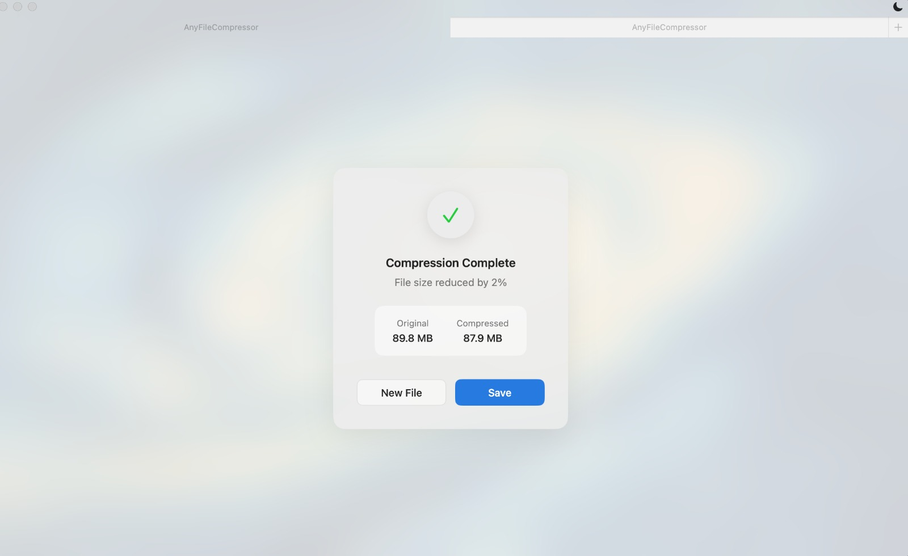

# AnyFileCompressor built native for macOS

#### 01. Brief Description of Project 
AnyFileCompressor is a SwiftUI-based macOS application that lets users quickly compress almost any file type—images, videos, audio, PDFs, text documents, even archives—down to optimized output formats. It offers both single-file and batch processing via a drag-and-drop interface, complete with progress indicators, customizable settings (resize dimensions, quality presets), built-in caching, and seamless integration into the macOS menu bar for one-click access.

#### Core Features
- Multiple Input Methods: Drag & drop or click to select files
- Real-time Progress: Watch your files being compressed with a clean progress indicator
- Compression Stats: See how much space you've saved instantly
- Dark and Light modes: Seamlessly integrates with your system preferences
- Native Performance: Built with SwiftUI for optimal macOS integration

#### 02. Users of the System
- Content creators who need to shrink large media (photos, videos) before uploading.
- Developers packaging assets or logs for distribution.
- Students and office workers constrained by file-size limits on email or LMS uploads.
- Archivists and researchers managing large document collections.
- Anyone on macOS who wants a simple tool to batch-compress files without opening multiple apps.
#### 03. What is unique about your solution
- Universal format support: handles common image (PNG, JPEG, WebP, SVG), video (MP4, MOV, AVI), audio (MP3, WAV, M4A), PDF and text formats—all in one app.
- Batch & single-file modes with per-file progress tracking.
- Drag-and-drop zoning with on-the-fly resizing controls.

#### 04. What are the new features you have included in this Mobile App compared to Assignment 01
This is not an extension of Assignment 1. In Assignment 1, the use case was different and doesn't exactly align with a macOS interface.

#### 05. What are the platform specific features that you have incorporated
- NSVisualEffectBlur for true macOS vibrancy.
- AppKit bridging (NSApplicationDelegateAdaptor) to manage lifecycle and terminate cleanup.
- MenuBarExtra/MenuBarController to live in the status bar.

#### 06. What are the advanced library integrations you are using
- AVFoundation for frame-accurate video re-encoding and bitrate control.
- PDFKit to render and recompress PDF pages.
- CoreGraphics for low-level image resizing/compression.
- UniformTypeIdentifiers for robust UTType detection.

#### 07. Briefly document the functionality of the screens you have (Include screen shots of images)

Main Interface of dropping files into the application
  

Dark theme feature!
  

Progress for file compression
  

Statistics of compression (Compression factor, Original Size, New file size)
  

Multi Window feature
  


#### 08. Give examples of best practices used when writing code
Thread-safe concurrency with actor. By isolating all video-encoding state inside an actor, we avoid data races without manual locking:

```
@available(macOS 12.0, *)
actor VideoProcessor {
  enum VideoError: LocalizedError {
    case exportFailed, invalidInput, compressionFailed
    var errorDescription: String? { /* … */ }
  }

  func compressVideo(at url: URL,
                     to tempURL: URL,
                     settings: CompressionSettings) async throws -> URL {
    try await withCheckedThrowingContinuation { continuation in
      let exportSession = /* configure AVAssetExportSession */
      exportSession.exportAsynchronously {
        switch exportSession.status {
        case .completed:
          continuation.resume(returning: exportSession.outputURL!)
        case .failed:
          continuation.resume(throwing: exportSession.error ?? .exportFailed)
        default:
          continuation.resume(throwing: VideoError.compressionFailed)
        }
      }
    }
  }
}

```
Converting callback-APIs to async/await. Wrangling AVFoundation’s callback style into structured concurrency makes higher-level code linear and error-safe:
```
let outputURL = try await withCheckedThrowingContinuation { continuation in
  exportSession.exportAsynchronously { 
    if exportSession.status == .completed {
      continuation.resume(returning: exportSession.outputURL!)
    } else {
      let err = exportSession.error ?? .exportFailed
      continuation.resume(throwing: err)
    }
  }
}
```

Computed Properties for derived state. ProcessingResult calculates things like percent saved and suggested filenames on demand:
```
struct ProcessingResult {
  let originalSize: Int64
  let compressedSize: Int64
  let compressedURL: URL
  let originalFileName: String

  var savedPercentage: Int {
    guard originalSize > 0 else { return 0 }
    return Int(((Double(originalSize) - Double(compressedSize)) / Double(originalSize)) * 100)
  }

  var suggestedFileName: String {
    let clean = originalFileName
      .replacingOccurrences(of: #"[A-F0-9]{8}-…\.#"#, with: "", options: .regularExpression)
    let base = URL(fileURLWithPath: clean).deletingPathExtension().lastPathComponent
    return "\(base)_compressed.\(compressedURL.pathExtension)"
  }
}

```


#### 09. UI Components used
- VisualEffectBlur: custom SwiftUI wrapper for NSVisualEffectView.
- TitleBarAccessory / WindowAccessor: to embed custom controls into the title bar.
- GlassButtonStyle: semi-transparent macOS–style buttons.
- ButtonGroup: reusable grouped buttons for settings toggles.

#### 10. Testing carried out
- Unit tests in AnyFileCompressorTests: Verifying correct output file extensions for each input UTType. Asserting that CompressionError cases are thrown on invalid inputs.
- UI tests in AnyFileCompressorUITests: Simulating drag-and-drop into DropZoneView. Confirming progress bars update and “Open in Finder” launches correct URL.

#### 11. Documentation 

(a) Design Choices
- Chose SwiftUI + MVVM to get declarative UI and easy state binding.

(b) Implementation Decisions
- Used AVFoundation over shell-based ffmpeg for tighter macOS integration
  
(c) Challenges
- Handling dozens of file formats with one unified API.
- Keeping UI responsive during CPU-intensive compressions.

#### 12. Reflection

During development, juggling multiple multimedia APIs (AVFoundation, PDFKit, CoreGraphics) proved tricky—especially ensuring progress callbacks landed on the main thread. 

